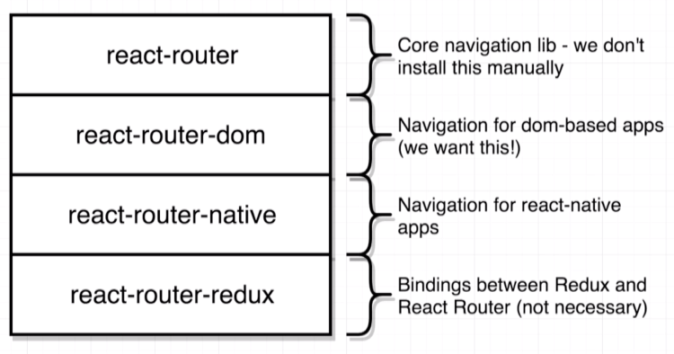
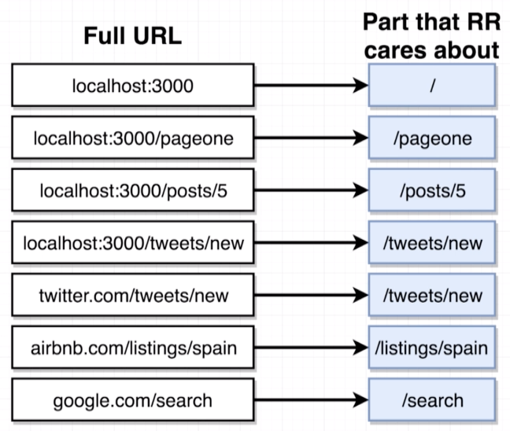
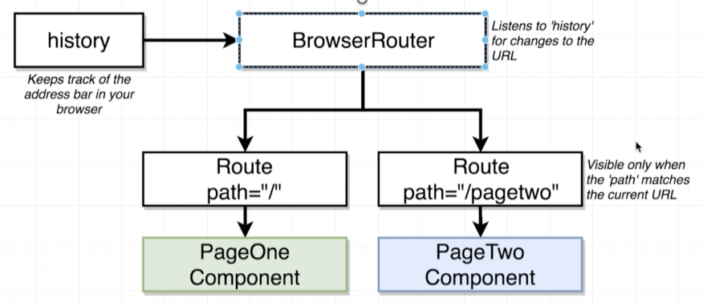
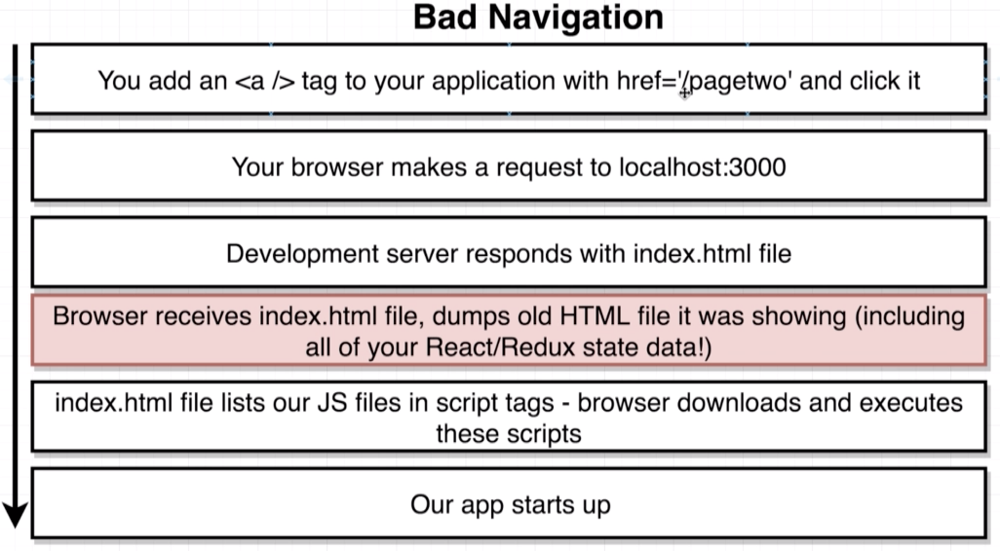
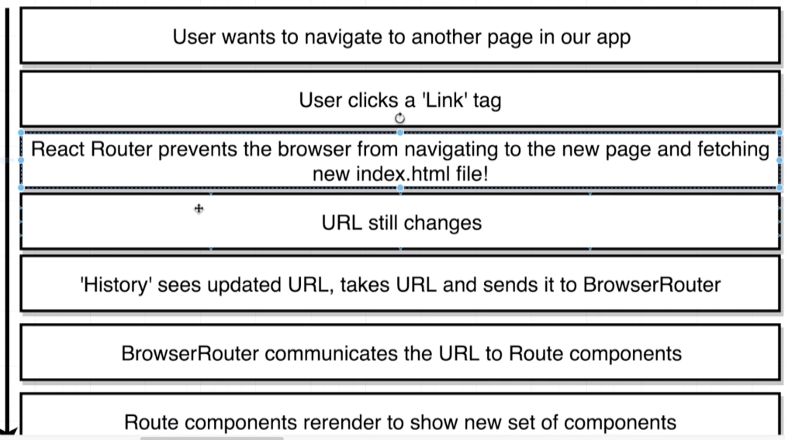

# Streamer: React-Redux App 

## Chapter 1: Overview
### 1.1 Wire-Frames
Index page signed in

Index page signed out

Show page

Create stream

Delete stream

### 1.2 App challenges

1. React router will be used
2. Google O-Auth will be used
3. Redux-Form will be used
4. CRUD functionality  
5. Custom error handling

### 1.3 Dependencies
`npm i redux react-redux axios redux-thunk react-router-dom`
 - [x] redux: The redux library. 
 - [x] react-redux: Integration layer between react and redux.
 - [x] axios: Network/http requests
 - [x] redux-thunk: Middleware to help make requests in a redux app
 - [x] react-router-dom: How we will be routing to different pages

## Chapter 2: React-Router-DOM

### 2.1 react-router-dom overview
* These are the different routers we could install
* We **only** want `react-router-dom`

* `npm i react-router-dom` if you have not done so yet

### 2.2 How react-router-dom works

##### The URL
* React-router-dom does not care about the entire URL. Only looks after the "/"
* As demonstrated in the image below
  

##### History object
* When we write the BrowserRouter component we make a new instance of it
* Internally BrowserRouter makes a new `history` object.
* The history object looks at the URL inside of the address bar and provides BrowserRouter with the portion of the URL that react cares about. (see above)
* Then BrowserRouter provides the route components with that url
* The route components then decide whether to show/hide themselves based on the url provided to them.

##### How paths get matched
* Each `<Route path='/' exact component={pageOne}>` is provided with 3 props
* `path='/'` is what the Route uses to descide whether or not to show that component on the screen
* `exact` is used to match the route **exactly**
* `component={pageOne}` The component provided to the component prop is displayed if it is matched
* Therefore if 2 routes match then 2 components will be displayed
* This is by design. There are cases when we would want to do this. 
* If you dont use exact it will also match multiple routes
* A usecase would be to display an advet on all routes with `/sales` in it. 

### 2.2 How navigate with react-router-dom

##### How **not** to navigate

    Take away: 
* We do not want the page to refresh!
* Do not use `<a>` tags. 

##### How to navigate
* Instead use the `Link` from `browser-router`
* eg `<Link to="/home">Home<Link/>`
* It will be transpiled ot `<a>` tags later BUT it will not refresh. 

1. User needs to navigate to another page in the app
2. User clicks the `<Link>` tag. NB: not an `<a>`
3. RRD prevents navigating to a new page
4. URL stil changes as if normal navigation occured.
5. Therefore history will see the updated URL and informs RRD about the update
6. BR matches the URL and communicates it to the Route components
7. Route components re-render to show a new set of components.

Extra notes: 
* The SPA term comes from the fact that the page is not changing in anyway. 

