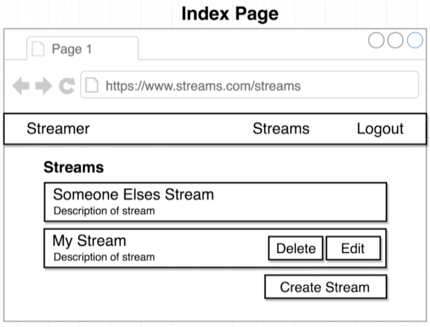
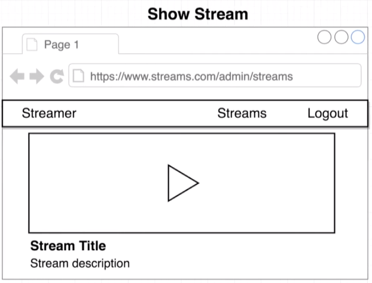
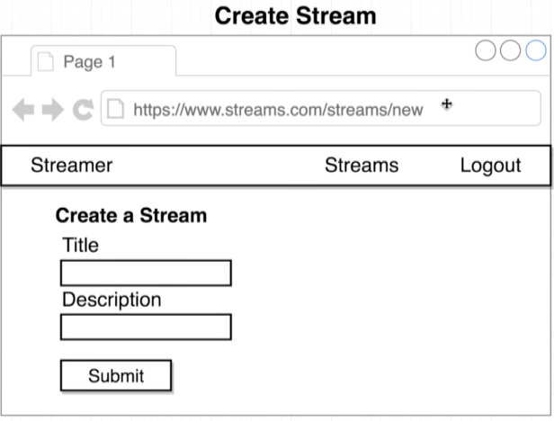
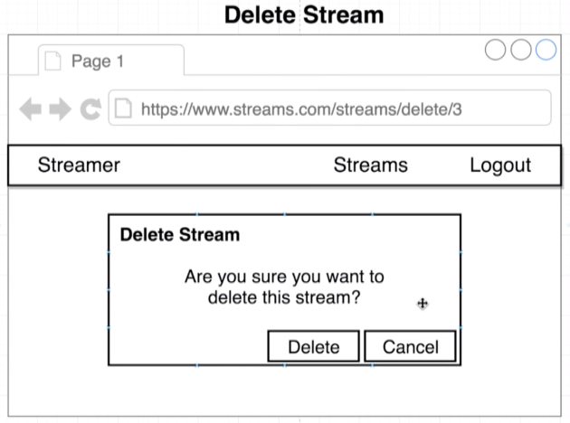
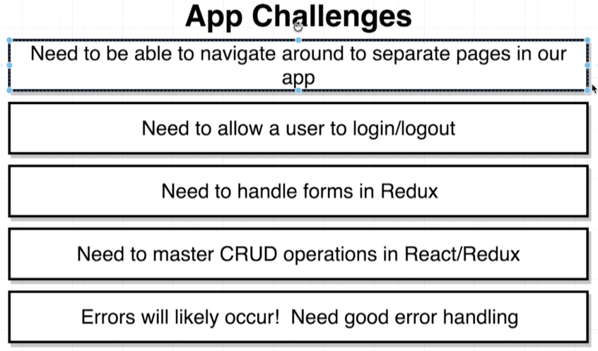

# Streamer: React-Redux App 

## Overview
### 1.1 Wire-Frames
Index page signed in

Index page signed out

Show page

Create stream

Delete stream

### 1.2 App challenges

1. React router will be used
2. Google O-Auth will be used
3. Redux-Form will be used
4. CRUD functionality  
5. Custom error handling

